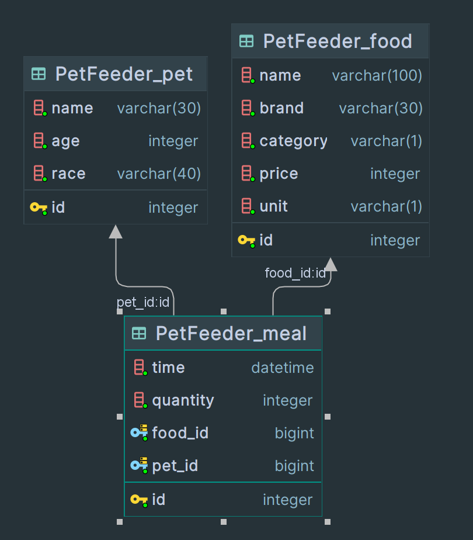

<h1>Pet Feeder Backend</h1>
<h2>List Of Contents</h2>
<ul>
    <li><h3><a href="#Setup">Setup</a></h3></li>
    <li><h3><a href="#Database">Data Base Model</a></h3></li>
        <ul>
            <li><a href="#D-Pet">Pet</a></li>
            <li><a href="D-Food">Food</a></li>
            <li><a href="D-Meal">Meal</a></li>
        </ul>
    <li><h3><a href="#API-Endpoints">Rest API</a></h3></li>
        <ul>
            <li><a>Endpoints</a></li>
        </ul>
</ul>
<h2 id="Setup">Setting up Django Project</h2>

<ol>
  <li>
    <strong>Navigate to the project directory</strong>
    <pre><code>cd this-repo</code></pre>
    
Replace <code>this-repo</code> with your actual directory name.

  </li>
  <li>
    <strong>Create a virtual environment</strong>
    
Creating a virtual environment is recommended as it isolates your Python/Django setup on a per-project basis.

    <pre><code>python -m venv env</code></pre>
    
This will create a new virtual environment in the <code>env</code> directory.

  </li>
  <li>
    <strong>Activate the virtual environment</strong>
    
If you're on a Windows machine:

    <pre><code>env\Scripts\activate</code></pre>
    
If you're on Unix or MacOS:

    <pre><code>source env/bin/activate</code></pre>
  </li>
  <li>
    <strong>Install dependencies</strong>
    
Here, we'll use pip to install Django and other dependencies from the <code>requirements.txt</code>file:

    <pre><code>pip install -r requirements.txt</code></pre>
  </li>
  <li>
    <strong>Migrate the database</strong>
    
Django comes with built-in commands for migrating your database. Here's how you do it:

    <pre><code>python manage.py makemigrations
python manage.py migrate</code></pre>
  </li>
  <li>
    <strong>Create a superuser</strong>
    
This command will allow you to create an admin user (superuser) who can log into the Django admin site:

    <pre><code>python manage.py createsuperuser</code></pre>
    
You'll be asked to enter an email address and a password for the superuser.

  </li>
  <li>
    <strong>Run the Django app</strong>
    
Use the following command to start the server:

    <pre><code>python manage.py runserver</code></pre>
    
You should now be able to access your Django project at <a href="http://127.0.0.1:8000"><code>http://127.0.0.1:8000</code></a>.

  </li>
</ol>

This setup guide assumes Python and Pip are already installed on the machine. It's also important to note that the
default server setup is sufficient for development purposes. 
When running in a production scenario, consider using an actual server like Gunicorn or uWSGI.

<h2 id="Database">Database Documentation</h2>

Our database is made up of three tables: <code>Pet</code>, <code>Food</code>, and <code>Meal</code>.

<h3 id="D-Pet">1. Pet</h3>

This table stores all data related to pets. Here are the fields for <code>Pet</code>:

<ul>
  <li><code>name</code>: A <code>CharField</code> storing the name of the pet. Maximum length is 30 characters.</li>
  <li><code>age</code>: An <code>IntegerField</code> storing the age of the pet.</li>
  <li><code>race</code>: A <code>CharField</code> storing the race of the pet. Maximum length is 40 characters.</li>
</ul>

This model returns the <code>name</code> field in its <code>__str__</code> method. The pets are ordered by their <code>name</code> in ascending order.

<h3 id="D-Food">2. Food</h3>

This table stores all data related to pet food. Here are the fields for <code>Food</code>:

<ul>
  <li><code>name</code>: A <code>CharField</code> storing the name of the food. Maximum length is 100 characters.</li>
  <li><code>brand</code>: A <code>CharField</code> storing the brand of the food. Maximum length is 30 characters.</li>
  <li><code>category</code>: A <code>CharField</code> storing the category to which the food belongs. It can be 'Dry' (D), 'Wet' (W), or 'Snack' (S). Its length is set to 1 character.</li>
  <li><code>price</code>: An <code>IntegerField</code> storing the price of the food.</li>
  <li><code>unit</code>: A <code>CharField</code> indicating in which unit the food is measured. It can be 'grams' (g) or 'milliliters' (ml). Its length is set to 1 character.</li>
</ul>

<h3 id="D-Meal">3. Meal</h3>

This table stores all data related to the meals the pets have. Here are the fields for <code>Meal</code>:

<ul>
  <li><code>time</code>: A <code>DateTimeField</code> storing the timestamp when the meal was created. It is automatically set to the time of creation.</li>
  <li><code>food</code>: A <code>ForeignKey</code> linking to the <code>Food</code> model. If the food instance is deleted, all meals associated with it will also be deleted due to the <code>CASCADE</code> deletion rule.</li>
  <li><code>pet</code>: A <code>ForeignKey</code> linking to the <code>Pet</code> model. If the pet instance is deleted, all meals associated with it will also be deleted due to the <code>CASCADE</code> deletion rule.</li>
  <li><code>quantity</code>: An <code>IntegerField</code> storing the quantity of food consumed during the meal. Its default value is 0.</li>
</ul>

These models should altogether provide a comprehensive overview of pet meals, including what foods are eaten, by which pets, and in what quantities.

<h2 id="API-Endpoints">REST API Documentation</h2>

This document outlines the endpoints provided by our Django-based REST API, which revolves around three key resources: <code>Meal</code>, <code>Food</code>, and <code>Pet</code>.

<h3>Endpoints</h3>

<dl>

<dt><code>GET, POST /api/food/</code></dt>
<dd>Show a list of all food items or create a new food item if authenticated. The <code>POST</code> method requires a JSON body with food data.</dd>

<dt><code>GET, PUT, DELETE /api/food/&lt;id&gt;/</code></dt>
<dd>Retrieve, update or delete a specific food item by id if authenticated.</dd>

<dt><code>GET, POST /api/pet/</code></dt>
<dd>Show a list of all pets or create a new pet if authenticated. The <code>POST</code> method requires a JSON body with pet data.</dd>

<dt><code>GET, PUT, DELETE /api/pet/&lt;id&gt;/</code></dt>
<dd>Retrieve, update or delete a specific pet by id if authenticated.</dd>

</dl>

Note: All API endpoints require user authentication.

