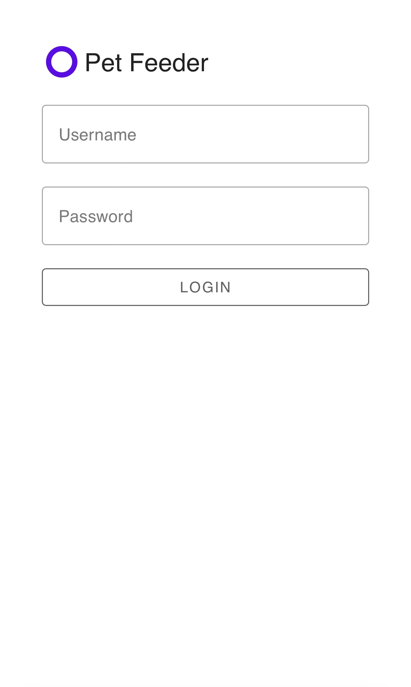
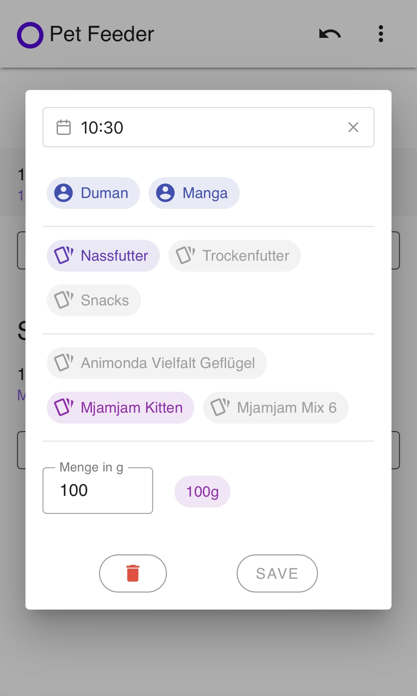
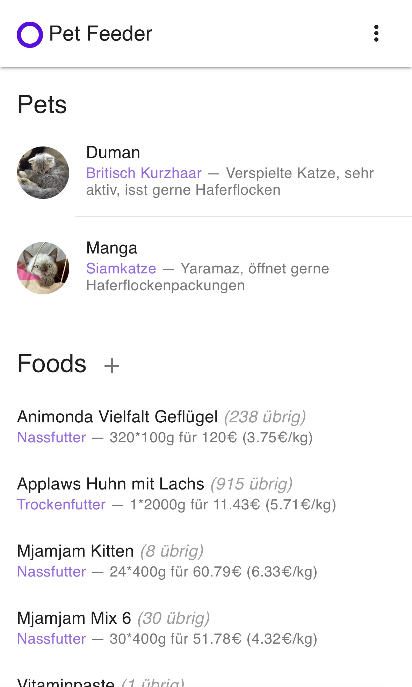
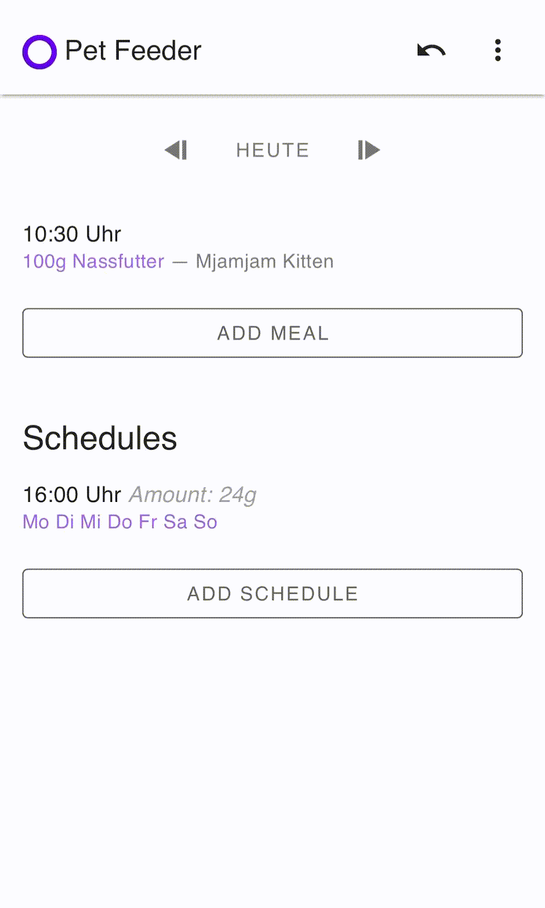
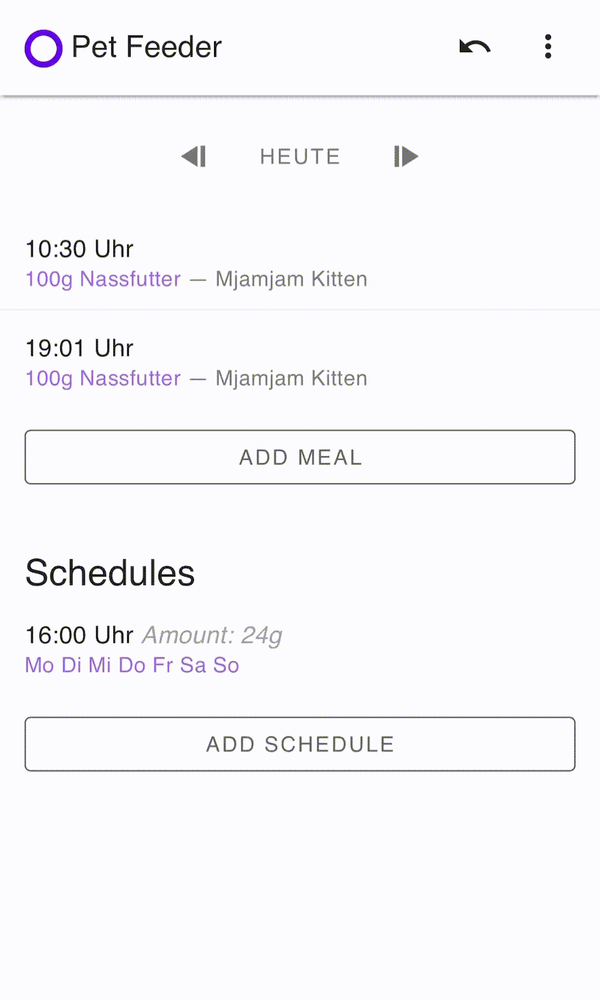

# pet-tracking

## Table of Contents

- [pet-tracking](#pet-tracking)
  - [Table of Contents](#table-of-contents)
  - [What does it look like?](#what-does-it-look-like)
  - [Ideas to implement](#ideas-to-implement)
  - [Get Started](#get-started)
  - [Production](#production)

## What does it look like?

Login Page                                |  Home Page
------------------------------------------|--------------------------
       |  

Adding Meal                               |  Setting Page
------------------------------------------|--------------------------
   |  

Process Adding Meal                       |  Animation
------------------------------------------|--------------------------
adding a meal is quick and easy           |  animations provide better user experience
     |  
## Ideas to implement

- [ ] Native app for ios and android
  - [ ] widgets for ios (and maybe android)
- [ ] Planner: possibility to specify that you can feed in the morning or evening then you do not always have to coordinate feedings in your household
- [x] Inventory: a page to add new foods and also track remaining amount of the food
- [x] Automatic Pet Feeder Machine
  - [x] a page to configure the pet feeder machine
  - [ ] trigger manual feeding
  - [x] change schedule for automatic feeding
- [x] Animations

## Get Started

First rename `.env.example` to `.env` and adjust the environment vars to your liking.
Then use `docker compose` to easily run the dev setup (Django, Nuxt, Nginx Proxy).

```sh
docker compose up
```

## Production

For production, there are two steps:

1. backend:
   1. use `docker compose -f prod.yml up -d` to start nginx and the backend
   2. make sure `DJANGO_DEBUG` is set to 0 and `DJANGO_SECRET_KEY` is set to a long and random value
   3. to create super user run `docker exec -ti django python manage.py createsuperuser --no-input`. Set `DJANGO_SUPERUSER_USERNAME`, `DJANGO_SUPERUSER_PASSWORD` and `DJANGO_SUPERUSER_EMAIL` in docker compose file before running the command.

2. frontend:
   1. run `npx nuxi generate` in the frontend folder to generate .output/public and serve the public folder with an nginx/apache server
