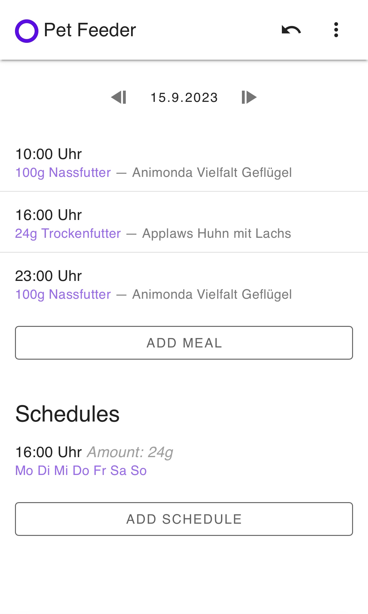

# Pet Feeder

## Table of Contents

- [Pet Feeder](#pet-feeder)
  - [Table of Contents](#table-of-contents)
  - [Why Pet Feeder?](#why-pet-feeder)
  - [Introduction](#introduction)
  - [What does it look like?](#what-does-it-look-like)
  - [Ideas to implement](#ideas-to-implement)
  - [Get Started](#get-started)
  - [Production](#production)
  - [Deploy to iOS](#deploy-to-ios)

I would like to thank [Vinh An](https://github.com/anvinh01) for his contributions to this project. He laid the foundation for the backend in Django using [Django REST framework](https://www.django-rest-framework.org).

## Why Pet Feeder?

I am living in household where multiple people are feeding the pets. So knowing if your roommate has fed the pets is essential in order to avoid instances where we are double feeding or not feeding at all. So to keep track is one the core features. Of course there are also many more features.

So i did what a computer science student would do and programmed and app that would solve the problem.

## Introduction

Pet Feeder is an app to **keep track** of the **meals** you are giving a pet.
This way, you can have multiple people in a household feeding a pet, without having
to ask your household if the pets was fed. You can look it up in the app. Just add the
meals you have fed to the app.

You will also have a **log** of what you have fed the pets.

Furthermore this application also makes it possible to **manage** an **Automatic Pet Feeder Machine**. You can feed your cat even if you are not at home.

On top of that, there is also an **inventory** where you can check how much food is left. For example, if you store food in the basement. When you add meals to the app, the inventory is **automatically updated**. Instead of running down to the basement, you can just check the app. You can also see how much money you spent on food.

## What does it look like?

Login Page                                |  Home Page
------------------------------------------|--------------------------
       |  

Adding Meal                               |  Setting Page
------------------------------------------|--------------------------
   |  

Process Adding Meal                       |  Animation
------------------------------------------|--------------------------
adding a meal is quick and easy           |  animations provide better user experience
     |  
## Ideas to implement

- [ ] Native app for ios and android
  - [ ] widgets for ios (and maybe android)
- [ ] Planner: possibility to specify that you can feed in the morning or evening then you do not always have to coordinate feedings in your household
- [x] Inventory: a page to add new foods and also track remaining amount of the food
- [x] Automatic Pet Feeder Machine
  - [x] a page to configure the pet feeder machine
  - [ ] trigger manual feeding
  - [x] change schedule for automatic feeding
- [x] Animations

## Get Started

First rename `.env.example` to `.env` and adjust the environment vars to your liking.
Then use `docker compose` to easily run the dev setup (Django, Nuxt, Nginx Proxy).

```sh
docker compose up
```

## Production

For production, there are two steps:

1. backend:
   1. use `docker compose -f prod.yml up -d` to start nginx and the backend
   2. make sure `DJANGO_DEBUG` is set to 0 and `DJANGO_SECRET_KEY` is set to a long and random value
   3. to create super user run `docker exec -ti django python manage.py createsuperuser --no-input`. Set `DJANGO_SUPERUSER_USERNAME`, `DJANGO_SUPERUSER_PASSWORD` and `DJANGO_SUPERUSER_EMAIL` in docker compose file before running the command.

2. frontend:
   1. run `npx nuxi generate` in the frontend folder to generate .output/public and serve the public folder with an nginx/apache server

## Deploy to iOS

Cross platform app build with [Capacitor](https://capacitorjs.com/).

Following steps explain how to deploy for production on iOS ([Capacitor iOS](https://capacitorjs.com/docs/ios)):

1. `cd frontend`
2. rename `.env.example` to `.env` and the url to your backend where the app can fetch the data
3. rename `capacitor.config.example.json` to `capacitor.config.json` and adjust the environment vars to your liking, also change server.hostname to the hostname of your backend server
4. if not already: `yarn install`
5. `npx nuxi generate` to build our Nuxt app
6. `npx cap add ios` to ios app to the project
   1. this step is only needed if you want to deploy to an iOS Device instead of Simulator: open the project in Xcode with `npx cap open ios` and add a signing team under `App > Signing & Capabilities`
7. `npx cap run ios` to deploy the app to the simulator/device

**Repeat steps 5 and 7** if you have made **changes** to the frontend.
