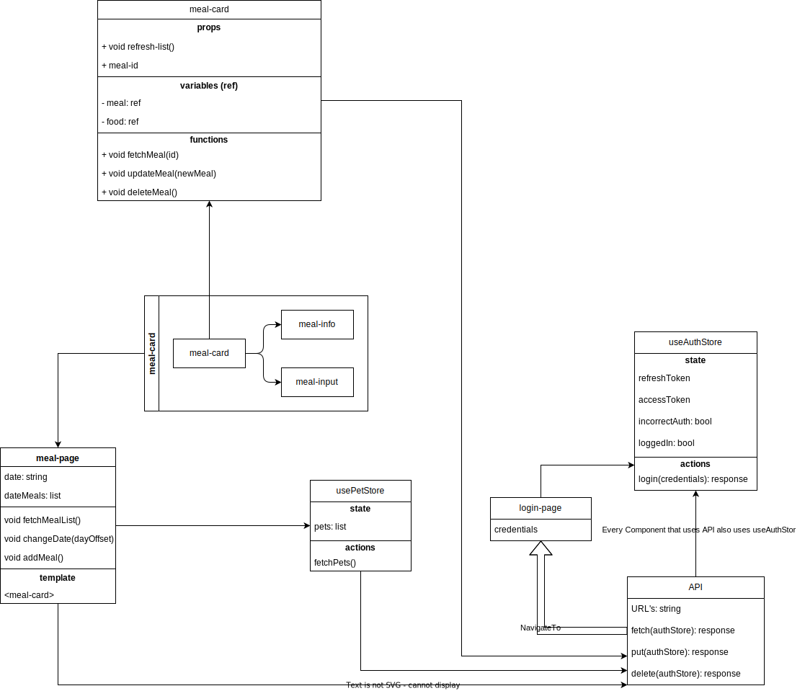

# Project Structure Documentation

This is a guide that helps new developers to understand the structure of this project. Please follow it carefully to understand the flow of the components.

## Directories and Their Purpose

### assets

This folder contains static assets to use with Vue.js templates.

### components

This folder contains reusable Vue.js components. Here's an overview of each one:

- **meal-card.vue**: This component displays a single meal. When created, it fetches detailed information for the meal from the API through the id. The data is displayed by meal-info and can be updated via meal-input.
- **meal-info.vue**: This component is used to display meal information, which is fetched from the `meal-card`.
- **meal-input.vue**: When the meal-info is pressed, this component will show up like an accordion. When data is filled here and saved, it will emit a signal to the parent with the input data. The meal-card will then handle the put request.
- **page-header.vue**:  A header component for all pages in the application.
- **tool-bar.vue**: This component serves as the nav-bar for the application.

### helpers

- **api.js**: This file contains helper functions responsible for making API calls.

### pages

These are the various pages present in the application. Following is a quick overview of each one:

- **index.vue -> login.vue**: The landing page redirecting to login page.
- **login.vue**: The login page where users can login to access the application.
- **meal-page.vue**: This page displays meals for a specific date. This page fetches initial data from the API and passes `meal id` to `meal-card` components.
- **food-page.vue**: **Under Development**
- **pet-page.vue**: **In Backlog**

### stores (with Pinia)

This folder contains our Pinia store definitions:

- **auth.js**: It handles application state related to authentication.
- **meals.js**: This Pinia module handles application state related to meals.
- **pets.js**: This Pinia module tackles application state related to pets.

The flow of information and updating is achieved through the VueJS's event system which helps components to communicate with each other. 
The `meal-page` raises the initial data fetch and updates information through `meal-info` and `meal-input` components within the `meal-card` component.

## Workflow for meal-page

### Updating meal
New developers may begin with updating meals information on the **meal-page.vue**. Here is a basic workflow:

1. **meal-page** fetches a list of meals from an API for a specific date upon initial load.
2. Once the data is received, it passes `meal id` to each `meal-card` component.
3. When a `meal-card` is clicked, it fetches the detail information for the meal using the passed id and display it through a `meal-info` component.
4. If `meal-info` component gets clicked, `meal-input` component shows up like an accordion element and can be used to update the meal.
5. Once the updates are filled and save is pressed `meal-input` emits an event with the updated data. This emitted event is captured by the parent `meal-card` which sends a PUT request to the API to update the data.
6. Upon successful update, `meal-card` component also updates its displayed information.

Ensure to respect this workflow while updating or modifying for consistency in communication and data flow across the application.
### Deleting meal
The deletion of a meal need the `meal-page` to refresh the data after deletion. Even though another fetch might be 
unnecessary, it ensures that the data displayed is in fact the data that is contained in the backend database:
1. Once the **`meal-card` is open** the meal-info component displays a button on the top right to delete the meal.
2. If this button is pressed it **emits a signal to the `meal-card`** to make a delete request.
3. After the delete request. The **`meal-card` emits a signal to the parent** (meal-page) to **fetch the meals again and refresh** the meals that are displayed.

### Creating meal
When creating a new meal, we dont want the frontend to immediately make a post request with an empty meal. We handle it
by pushing a meal into the meal-list in the `meal-page`, but the new meal doesn't have an id yet, because it is assigned once 
the meal is posted.

1. When the **+** button is pressed, we will push an empty meal into the `meal-list`. The template will be updated and a new `meal-card` will be seen.
2. The **new `meal-card`** can not fetch its information because it **does not have an id yet**. Instead, it will only fetch the food.
3. When the button for saving is pressed, we make a **distinction between a PUT and POST** request. If the meal **does not have an id** we will POST and create the meal.

The only difference between the updating and creating was the distinction if the meal is already in the database or new, which was achieved through the existing id.